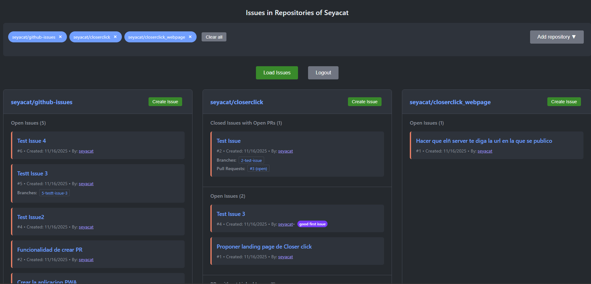

# GitHub Issues PWA



A Progressive Web App (PWA) built with Vue 3 that helps you manage GitHub issues and pull requests across your repositories.

**🌐 Live Demo:** [https://seyacat.github.io/github-issues/](https://seyacat.github.io/github-issues/)

## Key Features

- **Complete Issue Management**: View open issues and closed issues with active pull requests
- **Linked Pull Requests**: Automatic detection of related pull requests for each issue
- **Repository Selection**: Filter by specific repositories using dropdown selection
- **Branch Tracking**: Shows branches linked to issues (issue-{number}-* naming convention)
- **PWA Support**: Installable and works offline
- **Secure Authentication**: GitHub token stored locally in browser
- **Responsive Design**: Works on desktop and mobile devices

## Usage from GitHub Pages

The app is available directly from GitHub Pages:

1. **Access the app**: [https://seyacat.github.io/github-issues/](https://seyacat.github.io/github-issues/)
2. **Connect with GitHub**: Enter your personal access token
3. **Select repositories**: Choose which repositories to monitor from the dropdown
4. **Load issues**: View all issues and their related pull requests and branches

### Token Setup

1. Go to [GitHub Settings > Developer settings > Personal access tokens](https://github.com/settings/tokens)
2. Generate a token with permissions: `repo` and `read:org`
3. Use it in the app to access all your repositories (public, private, and organization repos)

## How It Works

The app connects to GitHub's API to fetch:

- **All repositories** you have access to (including organizations and collaborations)
- **Open and closed issues** with linked pull requests
- **Pull requests without linked issues**
- **Branches** following issue naming conventions

### Issue Categories

- **Closed Issues with Open PRs**: Issues that are closed but have active pull requests
- **Open Issues**: Currently open issues with their details
- **PRs without Linked Issues**: Pull requests that don't reference any issue

## Technologies

- Vue 3 with Composition API
- TypeScript
- Vite
- PWA (Vite Plugin PWA)
- GitHub REST API

## Development

```bash
npm install
npm run dev
npm run build
```

## Deployment

The app automatically deploys to GitHub Pages via GitHub Actions when the `main` branch is updated. The build output goes to the `/docs` folder for GitHub Pages compatibility.